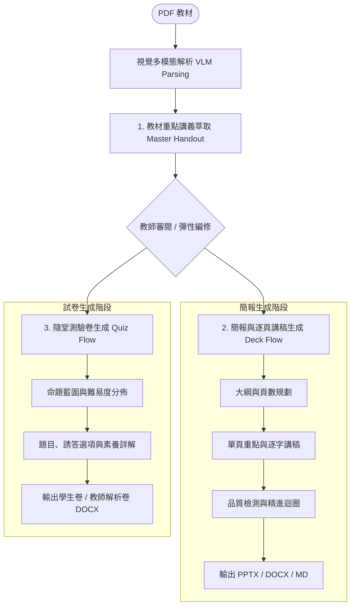

# 課伴 LessonFlow

課伴是一個以 **LangGraph 狀態圖**、**多部門 AI 團隊動態調度 (Agent Orchestration)** 與 **多模態檢索增強生成 (Multimodal RAG)** 為核心的 AI 教學助理與 SaaS 平台。上傳 PDF 教材後，能自動完成多模態視覺解析、重點講義編修、投影片與隨堂測驗卷連動生成，並提供防幻覺的教材問答體驗。

---

## 核心亮點

- **視覺頁面直解與精準數理萃取 (Vision-Native Direct Parsing)**：以 200 DPI 高解析度影像結合 VLM 視覺大模型，直接從視覺層面精準辨識並萃取 PDF 內的層級結構、複雜表格與 **LaTeX / Unicode 數學公式**，徹底解決傳統純文字提取容易遺漏圖表與算式符號的痛點。
- **教材講義核心驅動與連動生成 (Handout-Driven Adaptive Workflow)**：系統由教材提煉結構化重點講義，**教師可隨時介入編修**；後續的簡報大綱、逐頁演講稿、投影片重點與隨堂測驗卷，皆**以修改後的講義為核心基準，並緊扣原始教材細節連動生成**，確保教學邏輯與考評完全一致。
- **Self-RAG 防幻覺審查與精準頁碼溯源 (Hallucination-Free QA)**：內建文件相關性審查與防幻覺自檢機制，向教材提問時自動校對回答真實性，並**精準標註教材原文出處與頁碼**；支援可選聯網搜尋補充延伸教學案例。
- **多部門 AI 專家協作與全域導航 (Agent Ops Command Center)**：導入公司化多 Agent 治理架構，整合**教務教學、營運行政、技術維護、市場營銷**四大專屬 AI 部門，透過 `CompanyRouter` 實現自然語言意圖辨識與全域自動化任務調度。
- **多模型支援與極致輕量/隱私架構 (Multi-Provider & Zero-Leak Privacy)**：支援 **Google Gemini、OpenAI 雲端** 及 **Ollama（本機/雲端）** 動態即時切換。敏感考題與機密教材可 100% 走本機推論達成資料隱私；雲端模式採用延遲載入技術，伺服器記憶體極致優化（RAM < 250MB）。


---

## 核心架構：LangGraph 工作流 (Workflows)

本專案採用 **LangGraph 狀態圖 (StateGraph)** 實現兩大核心 AI 工作流：

### 1. 教學資產連動生成工作流 (Curriculum & Asset Generation Flow)

以「教材重點講義 (Master Handout)」為核心單一真實基準 (Single Source of Truth)，教師可隨時介入審閱編修，並一體化連動生成簡報與隨堂測驗卷：

1. **教材講義萃取與編修**：由 VLM 視覺解析結果萃取章節架構、關鍵概念與數學算式，生成結構化重點講義（支援 Word `.docx` 匯出）。
2. **簡報與逐頁講稿生成 (Deck Flow)**：以講義大綱為基準規劃投影片頁數與主題，結合可選聯網延伸數據，生成單頁重點與教師逐字演講稿（支援 PPTX / DOCX / MD 匯出），並執行品質檢測與改進建議迴圈 (Audit Loop)。
3. **隨堂測驗卷生成 (Quiz Flow)**：依據講義核心知識點規劃命題藍圖，生成單選/多選/情境素養題、誘答選項與詳細解析（支援學生卷與教師解析卷 Word `.docx` 匯出）。



---

### 2. 教材智能問答工作流 (Self-RAG + CRAG QA Flow)

- `retrieve` 檢索教材片段。
- `grade_documents` 進行相關性審查：
  - 若教材相關：進入 `generate_answer` 生成回答並標示頁碼，接續執行 `check_hallucination`（Self-RAG 防幻覺審查）。若審查合規即輸出；若偵測到幻覺則帶入 `hallucination_feedback` 回溯修正（最多重試 1 次）。
  - 若不相關且已開啟聯網搜尋：進入 `web_search` 搜尋補充資料後生成回答。
  - 若不相關且未開啟聯網搜尋：進入 `fallback_answer` 給予安全降級提示。


---

## 支援 4 大 AI 模型提供者

專案支援 4 種 AI 模型提供者，並支援在網頁左側控制台即時動態切換：

| 模式維度 | 預設首選：Google Gemini 雲端 | 商業穩定：OpenAI 雲端 | Ollama 雲端 | 完全隱私：Ollama 本機 |
|---|---|---|---|---|
| **首選場景** | **預設首選 (高 CP 值 / 極速)** | 商業高階 / 安定備用 | 雲端推論 / 自由選擇模型 | 敏感考題 / 機密資料 / 斷網環境 |
| **`AI_PROVIDER`** | `gemini` | `openai` | `ollama_cloud` | `ollama_local` |
| **文字生成 (LLM)** | `gemini-3.6-flash` | `gpt-4o-mini` | `qwen2.5:32b` | `qwen3:4b` |
| **視覺解析 (VLM)** | `gemini-3.6-flash` | `gpt-4o-mini` | `qwen2-vl:7b` | `qwen2-vl` (若無則降級 pypdf) |
| **Embedding 模型** | `gemini-embedding-2` (3072d) | `text-embedding-3-small` (1536d) | `bge-m3` (Ollama API) | `MiniLM-L12-v2` (384d, 延遲載入) |
| **記憶體優化 (RAM)** | 極致輕量 (RAM < 250MB) | 極致輕量 (RAM < 250MB) | 極致輕量 (無需負擔 PyTorch RAM) | 本機 GPU / CPU 執行 |

---

## 多部門 AI 團隊架構 (Company Router & Agent Ops)

課伴導入公司化的跨部門 AI 團隊運作模式，透過 **CompanyRouter (`StateGraph`)** 達成自適應意圖辨識與動態任務派發：

| 部門代號 | 部門名稱 | 特化 Agent Skill | 核心職責與處理範疇 |
|---|---|---|---|
| Teaching | 教務教學部 | `qa_teaching_tutor`<br/>`deck_generation_tutor` | 教材概念解析、問答流調優、簡報大綱、Word/PPTX 講稿生成、LaTeX 數學公式渲染與 Self-RAG 審查。 |
| Operations | 營運與行政部 | `user_quota_operations` | 使用者身份驗證 (JWT)、每日配額 (Quota Limit) 與會員層級管理、權限控制與系統營運規則廣播。 |
| DevOps | 技術維護部 | `railway_devops` | 雲端與 Docker 部署診斷、OOM 記憶體溢出排查、快取持久化與多 AI Provider 切換。 |
| Marketing | 市場與營銷部 | `saas_marketing` | SaaS 商業化模式、產品賣點包裝、社群貼文文案策劃與 SEO 優化。 |

---

## 快速開始與 Docker 部署

本專案建議使用 **Docker 與 Docker Compose** 進行環境建置與運行。

### 1. 複製專案與準備環境變數

```bash
git clone <repository-url>
cd lesson_flow
cp .env.example .env
```

在 `.env` 中設定您的 API Key 與提供者（例如預設 `AI_PROVIDER=gemini` 並填入 `GEMINI_API_KEY`，以及用於私有庫建置的 `GITHUB_TOKEN`）。

### 2. 啟動服務

#### 日常開發與執行：
```bash
docker compose up
```
- **即時熱更新 (Hot Reload)**：在編輯 `app/` 目錄下的程式碼時，容器將自動偵測並重載。
- **網頁進入點**：開啟瀏覽器造訪 **http://localhost:8000** 即可開始使用。

#### 首次建置或依賴更新時：
```bash
docker compose up --build
```

- **資料持久化**：宿主機 `./data/users.db` 將自動掛載至容器內 `/app/data/users.db`，確保使用者資料與每日配額持久保存。
- **停止服務**：按 `Ctrl + C` 或執行 `docker compose down` 即可。

---

### CLI 命令列工具

專案配備全功能命令列工具 `app/cli.py`，支援直接下達自然語言任務至 Agent Orchestrator：

```bash
python3 -m app.cli "請幫我排查 Railway 部署發生的 Out of Memory 錯誤"
python3 -m app.cli "寫一篇介紹 Self-RAG 防幻覺功能的 FB 宣傳貼文"
```

---

## AI 模式與配置說明

專案支援在 **網頁控制台** 即時動態切換以下四種提供者：

### 模式一：Gemini 雲端 API (預設首選)
前往 [Google AI Studio](https://aistudio.google.com/) 取得免費 API Key。
```dotenv
AI_PROVIDER=gemini
GEMINI_API_KEY=your-gemini-api-key
GEMINI_MODEL=gemini-3.6-flash
GEMINI_EMBEDDING_MODEL=gemini-embedding-2
```

### 模式二：OpenAI 雲端 API
前往 [OpenAI API Keys](https://platform.openai.com/api-keys) 建立金鑰。
```dotenv
AI_PROVIDER=openai
OPENAI_API_KEY=your-openai-api-key
OPENAI_MODEL=gpt-4o-mini
OPENAI_EMBEDDING_MODEL=text-embedding-3-small
```

### 模式三：Ollama 雲端 API
```dotenv
AI_PROVIDER=ollama_cloud
OLLAMA_BASE_URL=https://api.ollama.com
OLLAMA_API_KEY=your-ollama-api-key
OLLAMA_MODEL=deepseek-v4-flash:0731
OLLAMA_CLOUD_VISION_MODEL=qwen2-vl:7b
OLLAMA_EMBEDDING_MODEL=bge-m3
```

### 模式四：Ollama 本機服務 (完全隱私)
依照 [Ollama 官方文件](https://docs.ollama.com/) 安裝並下載模型：
```bash
ollama pull qwen3:4b
```
設定 `.env`：
```dotenv
AI_PROVIDER=ollama_local
OLLAMA_LOCAL_URL=http://localhost:11434
OLLAMA_LOCAL_MODEL=qwen3:4b
OLLAMA_LOCAL_VISION_MODEL=qwen2-vl
HUGGINGFACE_EMBEDDING_MODEL=sentence-transformers/paraphrase-multilingual-MiniLM-L12-v2
```

---

## API 開發者文件

本專案採用 FastAPI 架構，服務啟動後可直接造訪：
- **Swagger UI 互動式文件**：`http://localhost:8000/docs`
- **ReDoc 規格文件**：`http://localhost:8000/redoc`

---

## 專案結構

```text
.
├── Dockerfile           # Docker 容器建置設定 (含 CPU-only PyTorch 與 GITHUB_TOKEN 支持)
├── docker-compose.yml   # Docker Compose 服務編排（包含目錄掛載與 Hot Reload）
├── .dockerignore        # Docker 忽略檔案設定
├── app/
│   ├── main.py          # FastAPI 路由、認證、管理員控制台與核心端點
│   ├── models.py        # 文件、來源、問答、簡報、講義與測驗卷模型定義
│   ├── tiers.py         # 四大會員層級 (Tiering) 與每日流量配額定義
│   ├── services.py      # PyMuPDF 渲染、VLM 視覺解析、多模型整合與文件生成
│   ├── workflows/       # LangGraph 狀態圖工作流模組
│   │   ├── state.py     # QAState, DeckState, QuizState 狀態定義
│   │   ├── qa_graph.py  # Self-RAG + CRAG 問答狀態圖
│   │   ├── deck_graph.py# 講義驅動與多階段簡報生成狀態圖
│   │   ├── quiz_graph.py# 隨堂測驗卷多階段生成狀態圖
│   │   ├── router.py    # CompanyRouter 多部門調度狀態圖
│   │   ├── registry.py  # Agent Skills 註冊表與意圖關鍵字對照
│   │   └── handlers/    # 教務、營運、技術、行銷四大部門處理器
│   └── static/          # 前端展示首頁、控制台 UI 與 i18n 雙語模組
└── tests/
    ├── test_api.py
    ├── test_services.py
    └── test_workflows.py
```

---

## 測試

測試使用 Mock 的向量與 API 回應，不需要連線至外部付費服務：

```bash
# 透過 Docker 容器執行測試
docker compose exec app pytest -v

# 或於本機虛擬環境執行
python3 -m pytest -v
```

---

## 雲端部署 (Railway)

本專案支援透過 Docker 鏡像檔直接部署至 [Railway](https://railway.app)：

1. **私有依賴與 GITHUB_TOKEN**：請在 Railway 的 **Variables** 新增 `GITHUB_TOKEN`（具備 `fastapi-auth-lite` Read 權限的 PAT），建置時自動安裝。
2. **記憶體極致優化 (RAM < 250MB)**：當使用 `gemini`、`openai` 或 `ollama_cloud` 時，服務採用 Lazy Loading 機制，不載入本地龐大模型，記憶體佔用小於 250MB RAM。
3. **資料持久化**：於 Railway 新增 Volume 並掛載至 `/app/data`，確保 SQLite 使用者資料庫重啟不遺失。
