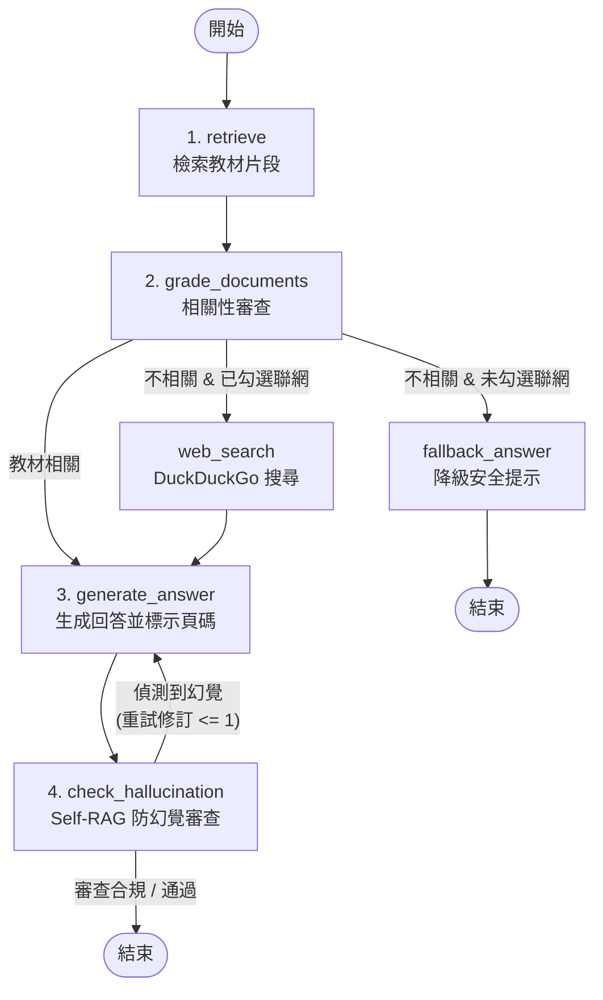
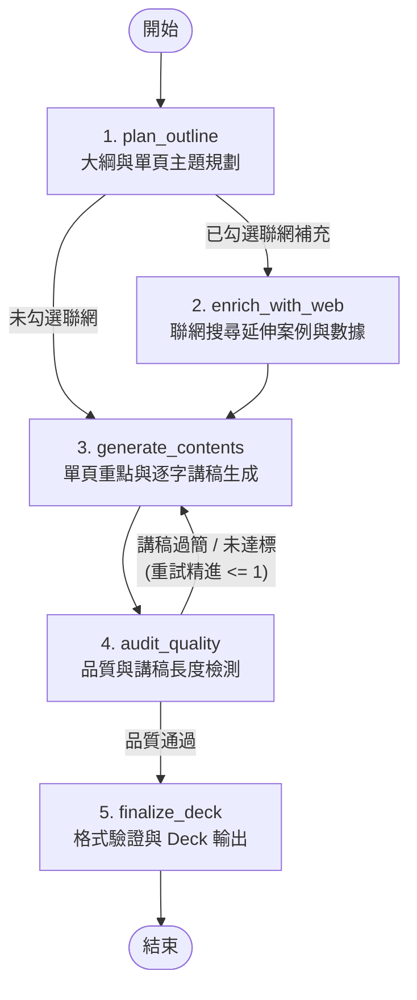

# 課伴 LessonFlow

課伴是一個以 **LangGraph 狀態圖** 與 **檢索增強生成 (RAG: Retrieval-Augmented Generation)** 為核心的 AI 教學助理。上傳 PDF 教材後，可以：

- 產生可下載的 PowerPoint 教學簡報與高品質逐頁演講稿
- 使用自然語言向教材提問，獲得附帶頁碼標示的精準回答
- **Self-RAG 防幻覺審查**：自動校對回答真實性，避免模型自創不實資訊
- **可選性網路補充搜尋 (Corrective RAG)**：當教材資訊不足或需延伸案例時，可勾選開啟聯網搜尋補足內容
- **🌐 EN / 繁體中文 雙語切換 (Bilingual i18n)**：支援點擊頂部導覽列按鈕即時切換全站介面、選單選項、提示與錯誤訊息，並持久化保存語系偏好
- **🔐 身分驗證與管理員控制台**：整合 JWT 認證、使用者權限控制（一般用戶 / 👑 系統管理員）與每日額度限制 (Quota Control)

---

## 🤖 支援 AI 模型提供者

專案支援三種 AI 模型提供者，並支援在網頁左側控制台即時動態切換：

| 模式 | 文字生成模型 | Embedding 模型 | 特色與適用情境 |
|---|---|---|---|
| Ollama 雲端 (`ollama_cloud`) | `deepseek-v4-pro:cloud` | Hugging Face Multilingual | 預設模式，雲端 API 推論，免本機顯示卡與本機 Ollama 服務 |
| Ollama 本機 (`ollama_local`) | 本機 Ollama (如 `qwen3:4b`) | Hugging Face Multilingual | 本機隱私推論、教材不離本機、無 API 費用 |
| OpenAI 雲端 (`openai`) | OpenAI GPT-4o-mini | OpenAI Embeddings | 穩定高品質生成，支援完整 OpenAI 生態 |

> 專案不包含範例教材、固定回答或模板生成降級；內容均來自使用者上傳的 PDF。

---

## 核心架構：LangGraph 工作流 (Workflows)

本專案採用 **LangGraph 狀態圖 (StateGraph)** 重構兩大 AI 核心作業：

### 1. 問答工作流 (Self-RAG + CRAG QA Flow)

- `retrieve` ➔ `grade_documents`（相關性審查）
- 若相關 ➔ `generate_answer` ➔ `check_hallucination`（防幻覺核對）
  - 若核對合規 ➔ 輸出解答
  - 若偵測到幻覺 ➔ 帶入 `hallucination_feedback` 回溯 `generate_answer` 重新修正生成（最多重試 1 次）
- 若不相關 & 開啟網路搜尋 ➔ `web_search` ➔ `generate_answer`
- 若不相關 & 未開啟網路搜尋 ➔ `fallback_answer`（安全降級提示）



### 2. 簡報生成工作流 (Multi-Stage Deck Flow with Audit Feedback Loop)

- `plan_outline`（第一階段：簡報大綱與單頁主題規劃）
- `enrich_with_web`（第二階段：可選聯網檢索延伸教學案例與數據）
- `generate_contents`（第三階段：單頁重點與逐字講稿生成；支援接收 `audit_feedback` 精進修訂）
- `audit_quality`（第四階段：品質與講稿長度檢測，未達標自動產生改進建議並回溯至 `generate_contents` 精進內容）
- `finalize_deck`（格式驗證與 `Deck` 模型輸出）



---

## 系統需求

- **Docker & Docker Compose**（建議，包含完整執行與套件環境）
- Python 3.10 以上（僅在不上 Docker、直接於宿主機手動執行時需要）
- 可選取文字的 PDF；掃描型 PDF 需先經過 OCR
- Ollama 本機模式需要安裝 [Ollama](https://docs.ollama.com/)
- OpenAI 模式需要有效的 OpenAI API Key

---

## 快速開始與 Docker 部署

本專案可使用 **Docker 與 Docker Compose** 進行開發與部署。

### 1. 複製專案與準備環境變數

```bash
git clone <repository-url>
cd lesson_flow
cp .env.example .env
```

### 2. 啟動服務

#### 🚀 平時日常開發：
```bash
docker compose up
```
* **即時熱更新 (Hot Reload)**：在 IDE 編輯 `app/` 目錄下的程式碼時，容器將自動偵測並重載，網頁刷新的即為最新程式碼。
* **網頁進入點**：開啟 **<http://localhost:8000>** 即可開始測試與使用。

#### 🔨 首次建置 / 修改 `requirements.txt` 時：
```bash
docker compose up --build
```

- **資料持久化**：宿主機 `./data/users.db` 將自動掛載至容器內 `/app/data/users.db`，確保使用者資料與每日配額持久保存。
- **健康檢查**：可透過 `curl http://localhost:8000/api/health` 查看 API 與模型服務狀態。
- **停止服務**：按 `Ctrl + C` 或執行 `docker compose down` 即可。

---

### (選用) 本地宿主機環境開發 (Host Virtualenv)

若選擇不安裝 Docker，直接在宿主機上執行：

```bash
python3 -m venv .venv
source .venv/bin/activate
pip install -r requirements.txt
uvicorn app.main:app --reload
```

---

## AI 模式與動態切換

專案支援 **Ollama 雲端**、**Ollama 本機** 與 **OpenAI 雲端** 三種 AI 提供者。除了在 `.env` 指定初始預設提供者外，使用者亦可在 **網頁左側控制台** 即時動態切換。若切換時偵測到 Embedding 維度不同，系統會自動重新剖析並更新已上傳文件的向量索引。

### 模式一：Ollama 雲端 API (預設)

設定 `.env`：
```dotenv
AI_PROVIDER=ollama_cloud
OLLAMA_BASE_URL=https://api.ollama.com
OLLAMA_API_KEY=your-ollama-api-key
OLLAMA_CLOUD_MODEL=deepseek-v4-pro:cloud
HUGGINGFACE_EMBEDDING_MODEL=sentence-transformers/paraphrase-multilingual-MiniLM-L12-v2
```

### 模式二：Ollama 本機服務

1. 依照 [Ollama 官方文件](https://docs.ollama.com/) 安裝並下載預設模型：
   ```bash
   ollama pull qwen3:4b
   ```
2. 設定 `.env`：
   ```dotenv
   AI_PROVIDER=ollama_local
   OLLAMA_LOCAL_URL=http://localhost:11434
   OLLAMA_MODEL=qwen3:4b
   HUGGINGFACE_EMBEDDING_MODEL=sentence-transformers/paraphrase-multilingual-MiniLM-L12-v2
   ```

### 模式三：OpenAI 雲端 API

1. 前往 [OpenAI API Keys](https://platform.openai.com/api-keys) 建立金鑰。
2. 設定 `.env`：
   ```dotenv
   AI_PROVIDER=openai
   OPENAI_API_KEY=your-openai-api-key
   OPENAI_MODEL=gpt-4o-mini
   OPENAI_EMBEDDING_MODEL=text-embedding-3-small
   ```

---

## 使用方式

1. 開啟 <http://127.0.0.1:8000>。
2. 可點擊頂部導覽列按鈕即時切換 **繁體中文** 或 **English**。
3. 註冊並登入帳號（新註冊帳號需由管理員審核開通）。
4. 上傳包含可擷取文字的 PDF 教材。
5. 選擇學習對象、教學語氣、課程時間、投影片數量，並可於左側選單隨時切換 AI 提供者（Ollama 雲端 / Ollama 本機 / OpenAI）。
6. 產生並預覽投影片及逐頁講稿。
7. 下載 `.pptx` 或 `.md`，或切換至「文件問答」向教材提問。

可透過健康檢查確認目前的提供者與模型：

```bash
curl http://127.0.0.1:8000/api/health
```

Ollama 雲端模式的回應範例：

```json
{
  "status": "ok",
  "provider": "ollama_cloud",
  "provider_label": "Ollama 雲端 API",
  "generation_model": "deepseek-v4-pro:cloud",
  "embedding_model": "sentence-transformers/paraphrase-multilingual-MiniLM-L12-v2"
}
```

---

## API 端點列表

| Method | Endpoint | 說明 |
|---|---|---|
| `GET` | `/api/health` | 顯示系統健康狀態與當前 AI 提供者 |
| `GET` | `/api/provider` | 查詢當前 AI 模型提供者詳細資訊與可切換選項 |
| `POST` | `/api/provider` | 動態切換 AI 模型提供者 (`ollama_cloud` / `ollama_local` / `openai`) |
| `POST` | `/api/auth/register` | 使用者註冊（新帳號需管理員審核） |
| `POST` | `/api/auth/login` | 使用者登入並取得 JWT Bearer Token |
| `GET` | `/api/user/me` | 查詢當前登入使用者身分與每日剩餘配額 |
| `POST` | `/api/user/change-password` | 修改當前使用者密碼 |
| `POST` | `/api/documents` | 上傳 PDF 並建立 embedding 向量索引（需登入） |
| `POST` | `/api/ask` | 根據指定文件回答問題（需登入與配額，可選 `enable_web_search`） |
| `POST` | `/api/decks` | 產生投影片及逐頁講稿（需登入與配額，可選 `enable_web_search`） |
| `GET` | `/api/decks/{deck_id}/pptx` | 下載 PowerPoint 簡報文件 |
| `GET` | `/api/decks/{deck_id}/script` | 下載 Markdown 演講腳本 |
| `GET` | `/api/admin/users` | [管理員] 查詢全站使用者列表與待審核清單 |
| `POST` | `/api/admin/users/review` | [管理員] 核准或拒絕使用者帳號開通 |
| `POST` | `/api/admin/users/role` | [管理員] 調整使用者權限角色 (`user` / `admin`) |
| `POST` | `/api/admin/users/reset-password` | [管理員] 強制重置指定使用者密碼 |
| `DELETE` | `/api/admin/users/{username}` | [管理員] 刪除指定使用者帳號 |

啟動服務後，可在 <http://127.0.0.1:8000/docs> 查看完整互動式 OpenAPI 文件。

---

## 專案結構

```text
.
├── Dockerfile           # Docker 容器建置設定
├── docker-compose.yml   # Docker Compose 服務編排（包含目錄掛載與 Hot Reload）
├── .dockerignore        # Docker 忽略檔案設定
├── app/
│   ├── main.py          # FastAPI 路由、Auth、Admin、PDF 上傳與核心端點
│   ├── models.py        # 文件、來源、問答與簡報 Pydantic/Dataclass 模型
│   ├── services.py      # PDF 解析、Embedding、向量檢索與 LangGraph 調用
│   ├── workflows/       # LangGraph 狀態圖工作流模組
│   │   ├── state.py     # QAState 與 DeckState 狀態定義
│   │   ├── qa_graph.py  # Self-RAG + CRAG 問答狀態圖
│   │   └── deck_graph.py# 多階段簡報生成狀態圖
│   └── static/          # HTML、CSS、JavaScript 前端 UI (含 i18n 雙語模組)
└── tests/
    ├── test_api.py
    ├── test_services.py
    └── test_workflows.py
```

---

## 測試

測試使用假的 embedding 與 Ollama 回應，不需要連線到外部服務。

### 透過 Docker 容器執行測試：
```bash
docker compose exec app pytest -v
```

### 透過本機環境執行測試：
```bash
python3 -m pytest -v
```

---

## Railway 部署

本專案支援透過 Docker 鏡像檔直接部署至 [Railway](https://railway.app)。

### 部署重點說明：
1. **私有模組與 GITHUB_TOKEN**：本專案依賴私有庫 `fastapi-auth-core`。請在 Railway 的 **Variables** 頁面新增 `GITHUB_TOKEN`（填入具備 `fastapi-auth-core` Read-only 權限的 Personal Access Token），Docker 建置時會自動從私有 GitHub 庫下載安裝。
2. **環境變數設定 (Variables)**：請於 Railway 控制台設定 `GITHUB_TOKEN`、`AI_PROVIDER`、`OLLAMA_BASE_URL`（或 `OPENAI_API_KEY`）、`JWT_SECRET_KEY`、`AUTH_DB_PATH=/app/data/users.db` 等變數。
3. **資料持久化 (Persistent Volume)**：請於 Railway 新增 Volume 並將掛載路徑設定為 `/app/data`，確保 SQLite 使用者資料庫重啟不遺失。

---

## 常見問題

### 無法連線到 Ollama

確認服務和模型：

```bash
ollama list
curl http://localhost:11434/api/tags
```

若 Ollama 位於其他主機，請修改 `OLLAMA_BASE_URL`。容器內的 `localhost` 指向容器本身，Docker 部署時通常需要使用宿主機位址。

### 顯示找不到 Ollama 模型

`OLLAMA_MODEL` 必須與 `ollama list` 顯示的名稱完全一致：

```bash
ollama pull qwen3:4b
```

### Hugging Face 模型下載失敗

確認第一次執行時可以連線到 Hugging Face。下載完成後可使用本機快取；也可以將 `HUGGINGFACE_EMBEDDING_MODEL` 設為本機模型目錄。

### OpenAI 模式啟動失敗

確認以下設定均存在，且重新啟動服務：

```dotenv
AI_PROVIDER=openai
OPENAI_API_KEY=your-api-key
```

### PDF 沒有可擷取的文字

此 PDF 很可能是掃描圖片。請先使用 OCR 工具建立文字層，再重新上傳。
